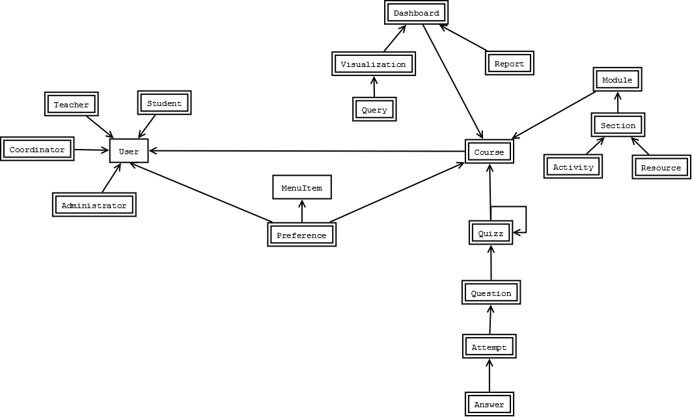

# Entities #

An abstraction/representation of a being of/with interacions, either with other entities or with the user themself.

## Diagrams

1. [Base entities](#base-entities)

### Base entities

